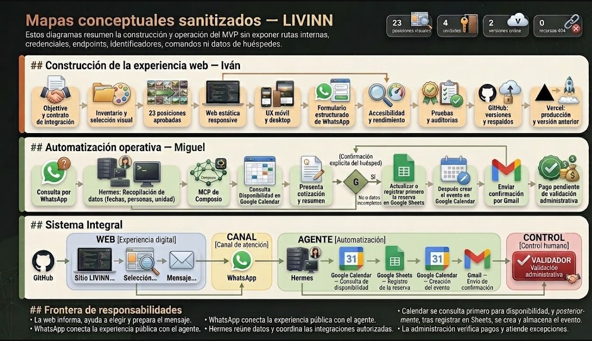

# LIVINN — MVP de experiencia y reservas

[Ver sitio publicado](https://mvp-livinn.vercel.app/) · [Ver versión anterior](https://mvp-livinn-anterior.vercel.app/)



LIVINN es un MVP académico para un complejo de cabañas en Llano Grande, Durango. El proyecto conecta una experiencia web responsive con un asistente operativo de WhatsApp, manteniendo separadas la comunicación pública, la automatización y la validación administrativa.

## Qué resuelve

- Presenta cuatro unidades con tarifas, servicios y galerías accesibles.
- Permite elegir unidad, fechas, huéspedes y comentario.
- Prepara un mensaje estructurado y abre la consulta en WhatsApp.
- El asistente reúne los datos y consulta disponibilidad mediante Google Calendar.
- Después de la confirmación explícita, registra primero la reserva en Sheets, crea el evento en Calendar y envía una confirmación por Gmail.
- Los pagos y casos excepcionales permanecen bajo validación humana.

## Arquitectura

```text
Sitio estático en Vercel
        ↓
Consulta estructurada por WhatsApp
        ↓
Hermes en VPS + MCP de Composio
        ↓
Calendar (consulta) · Sheets (registro) · Calendar (evento) · Gmail
        ↓
Validación administrativa
```

La landing no se conecta directamente a Google Calendar o Google Sheets y no confirma disponibilidad ni pagos de forma automática.

## Equipo

- **Iván:** integración visual y funcional de la web, experiencia responsive, accesibilidad, formulario de WhatsApp, pruebas, auditorías, GitHub, respaldos y Vercel.
- **Miguel:** VPS, Docker/Dokploy, Hermes, conexión de WhatsApp, MCP de Composio e integración operativa con Calendar, Sheets y Gmail.

## Contenido del repositorio

- `index.html`: entrada estática de producción.
- `LIVINN.dc.html`: fuente editable principal.
- `politicas.html`: políticas académicas de alojamiento y privacidad.
- `img/`: activos finales consumidos por la web.
- `IMAGE_MANIFEST.md`: relación de las 23 posiciones visuales.
- `auditoria_codex/`: verificaciones técnicas seleccionadas.
- `produccion_video/`: memorias, mapas, guiones y recursos para la presentación audiovisual.

## Ejecutar localmente

Desde la raíz:

```powershell
python -m http.server 4173 --bind 127.0.0.1
```

Abrir `http://127.0.0.1:4173/`. Para validar el comportamiento completo no se recomienda abrir `index.html` mediante `file://`.

## Estado y límites

- Sitio demostrativo y proyecto académico.
- Disponibilidad sujeta a confirmación.
- Sin cobros en línea.
- Redes sociales todavía demostrativas.
- Fotografías desarrolladas para representar la propuesta visual del MVP.
- La demostración del agente debe utilizar datos ficticios y ocultar credenciales e información real de huéspedes.

## Producción audiovisual

El proyecto documenta también su comunicación mediante tres publicidades verticales terminadas y un video explicativo en preparación:

- [Escapada](produccion_video/publicidad/finales/livinn_ad_01_escapada_9x16.mp4)
- [Consulta por WhatsApp](produccion_video/publicidad/finales/livinn_ad_02_consulta_9x16.mp4)
- [Cuatro refugios](produccion_video/publicidad/finales/livinn_ad_03_refugios_9x16.mp4)

Las memorias sanitizadas, mapas conceptuales y fuentes específicas de Iván están preparados para NotebookLM. Los videos generados funcionan como material explicativo intermedio; el cierre conjunto de 3–4 minutos deberá incorporar evidencia real de la web y revisión humana.
