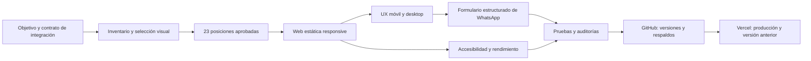
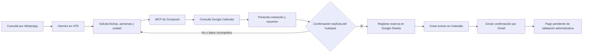

# Mapas conceptuales sanitizados — LIVINN

Estos diagramas resumen la construcción y operación del MVP sin exponer rutas internas, credenciales, endpoints, identificadores, comandos ni datos de huéspedes.

## Construcción de la experiencia web — Iván

## Automatización operativa — Miguel

## Sistema integral

```mermaid
flowchart LR
    subgraph WEB[Experiencia digital]
        A[Sitio LIVINN en Vercel] --> B[Unidades, galería, ubicación y políticas]
        B --> C[Selección de unidad, fechas y huéspedes]
        C --> D[Mensaje estructurado]
    end

    subgraph CANAL[Canal de atención]
        D --> E[WhatsApp]
    end

    subgraph AGENTE[Automatización]
        E --> F[Hermes en VPS]
        F --> G[MCP de Composio]
        G --> H[Calendar: consulta de disponibilidad]
        H --> I[Sheets: registro de reserva]
        I --> J[Calendar: creación del evento]
        J --> K[Gmail: confirmación]
    end

    subgraph CONTROL[Control humano]
        K --> M[Validación administrativa]
    end

    L[GitHub: código, documentación y respaldos] --> A
```

## Frontera de responsabilidades

- La web informa, ayuda a elegir y prepara el mensaje.
- WhatsApp conecta la experiencia pública con el agente.
- Hermes reúne datos y coordina las integraciones autorizadas.
- Calendar se consulta para disponibilidad y almacena el evento.
- Sheets registra la operación y Gmail envía la confirmación.
- La administración verifica pagos y atiende excepciones.
